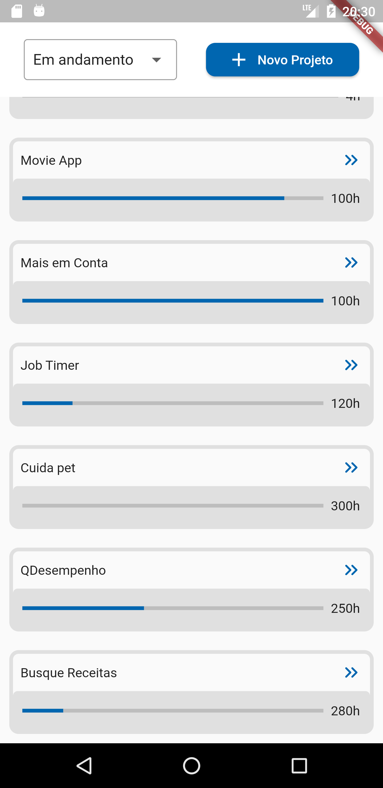
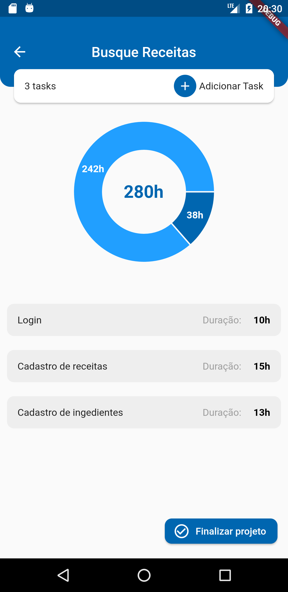

# Job timer

Projeto da academia do flutter desenvolvido no Dart Week. O aplicativo controla e gerencia as horas trabalhadas.

## Descrição

Este projeto foi desenvolvido com o propósito de estudar a aplicação dos seguintes conceitos e tecnologias:

<b>Flutter Modular</b>: O Flutter Modular foi utilizado para gerenciamento de rotas e injeção de dependências, organizando o código em módulos independentes, o que facilita a manutenção e o desenvolvimento.

<b>Cubit</b>: O Cubit é utilizado para gerenciar estados e lógica de negócios de forma eficaz.

<b>Database Isar</b>: O projeto utiliza o banco de dados Isar, para lidar com o armazenamento de dados de forma eficiente.

<b>Autenticação com Google</b>: A autenticação com o Google é implementada no projeto.

## Capturas de tela

    
    
    

## Autor

7ª Edição do #DartWeek
Feito por: [@daricesousa](https://www.github.com/daricesousa)
